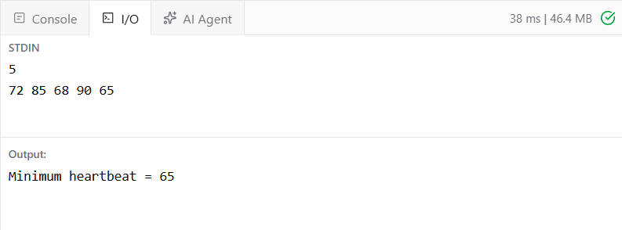

# EX 1 You’re creating a health monitoring device which stores several sensor readings in an array. To determine the minimum value (e.g., lowest heartbeat), implement a recursive method.
## DATE: 16-09-2026
## AIM:
To write a JAVA program To determine the minimum value (e.g., lowest heartbeat), implement a recursive method.

## Algorithm
1. Read the number of heartbeat values n.
2. Store the heartbeat values in an integer array.
3. Create a recursive method findMin() to find the minimum value.
4. If only one value is present, return that value as the minimum.
5. Recursively find the minimum among the first n-1 values.
6. Compare the last value with the recursive minimum.
7. Return the smaller value.
8. Display the minimum heartbeat value. 

## Program:
```
/*
Program To determine the minimum value (e.g., lowest heartbeat), implement a recursive method.
Developed by: Elavarasan M
RegisterNumber: 212224040083
*/
```

```java
import java.util.*;

public class MinimumHeartbeat {

    static int findMin(int[] arr, int n) {

        // Base case
        if (n == 1) {
            return arr[0];
        }

        // Recursive call
        int min = findMin(arr, n - 1);

        // Compare and return minimum
        return Math.min(arr[n - 1], min);
    }

    public static void main(String[] args) {

        Scanner sc = new Scanner(System.in);

        int n = sc.nextInt();

        int[] heartbeat = new int[n];

        for (int i = 0; i < n; i++) {
            heartbeat[i] = sc.nextInt();
        }

        int minimum = findMin(heartbeat, n);

        System.out.println("Minimum heartbeat = " + minimum);
    }
}
```

## Output:



## Result:
Thus the JAVA program to find the minimum value (e.g., lowest heartbeat), implement a recursive method has implemented successfully
