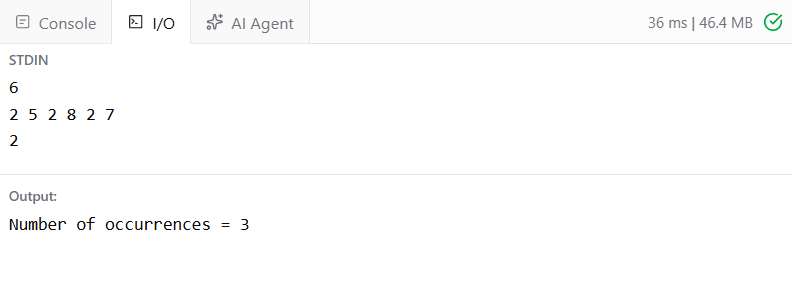

# Ex2 Count how many times a number appears in an array recursively.
## DATE: 16-09-2026
## AIM:
To write a Java program to Count how many times a number appears in an array recursively.

## Algorithm
1. Read the size of the array and its elements.
2. Read the number to be searched.
3. Create a recursive method countOccurrences() with the array, target number, and index.
4. If the index reaches the end of the array, return 0.
5. Recursively count occurrences from the next index.
6. If the current element equals the target number, add 1 to the recursive result.
7. Return the total count.
8. Display how many times the number appears.

## Program:
```
/*
Program Count how many times a number appears in an array recursively.
Developed by: Elavarasan M
RegisterNumber: 21224040083 
*/
```

```java
import java.util.*;

public class CountOccurrences {

    static int countOccurrences(int[] arr, int n, int target) {

        // Base case
        if (n == 0) {
            return 0;
        }

        // Recursive call
        int count = countOccurrences(arr, n - 1, target);

        // Check current element
        if (arr[n - 1] == target) {
            count++;
        }

        return count;
    }

    public static void main(String[] args) {

        Scanner sc = new Scanner(System.in);

        int n = sc.nextInt();

        int[] arr = new int[n];

        for (int i = 0; i < n; i++) {
            arr[i] = sc.nextInt();
        }

        int target = sc.nextInt();

        int result = countOccurrences(arr, n, target);

        System.out.println("Number of occurrences = " + result);
    }
}
```

## Output:



## Result:
Thus, the Java program to Count how many times a number appears in an array recursively is implemented successfully.
