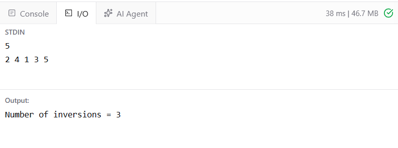

# Ex5 Count Inversions in an Array
## DATE: 16-09-2026
## AIM:
To write a Java program  to Count the number of inversions in an array where inversion is defined as: arr[i] > arr[j] and i < j

## Algorithm
1. Read the size n and elements of the array.
2. Initialize count = 0 to store the number of inversions.
3. Use two loops to compare every pair of elements.
4. For each pair (i, j), ensure i < j.
5. Check whether arr[i] > arr[j].
6. If the condition is true, increment count.
7. After checking all pairs, display the total number of inversions.

## Program:
```
/*
Program toto Count the number of inversions in an array where inversion is defined as: arr[i] > arr[j] and i < j
Developed by: Elavarasan M
RegisterNumber: 212224040083 
*/
```

```java
import java.util.*;

public class CountInversions {

    public static void main(String[] args) {

        Scanner sc = new Scanner(System.in);

        int n = sc.nextInt();

        int[] arr = new int[n];

        for (int i = 0; i < n; i++) {
            arr[i] = sc.nextInt();
        }

        int count = 0;

        for (int i = 0; i < n; i++) {
            for (int j = i + 1; j < n; j++) {

                if (arr[i] > arr[j]) {
                    count++;
                }
            }
        }

        System.out.println("Number of inversions = " + count);
    }
}
```
## Output:



## Result:
Thus the Java program to to Count the number of inversions in an array where inversion is defined as: arr[i] > arr[j] and i < jis implemented successfully.
